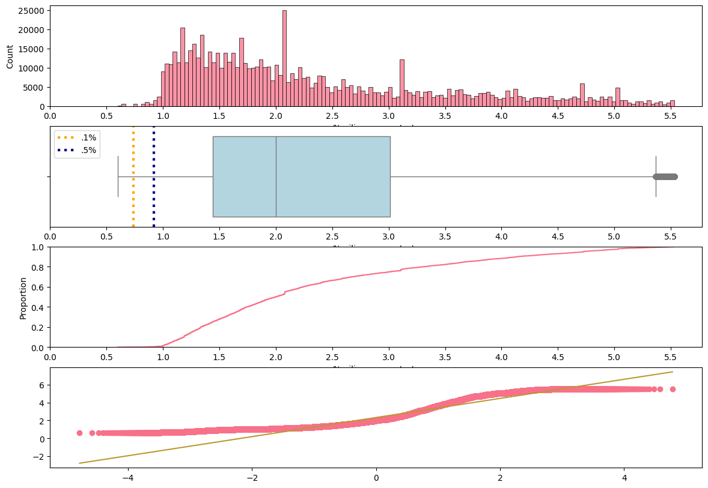

# Laporan Proyek Machine Learning - Prediksi Silika Proses Pertambangan

## Domain Proyek

Industri pertambangan dan pengolahan mineral memainkan peran vital dalam produksi sumber daya global, dimana kontrol kualitas dan optimisasi proses sangat mempengaruhi efisiensi operasional dan profitabilitas. Simon dan Gosson [1] menyarankan bahwa praktik jaminan dan kontrol kualitas (QA/QC) yang ketat memastikan data yang andal untuk pengambilan keputusan, yang secara langsung berdampak pada hasil proyek.
Salah satu tantangan utama dalam pengolahan mineral adalah memprediksi komposisi material output dari pabrik flotasi secara akurat [2]. Pabrik-pabrik ini menggunakan proses flotasi, teknik pemisahan penting yang memisahkan mineral berdasarkan sifat permukaan relatif mereka (hidrofobisitas) [3].
Khusus dalam flotasi bijih besi, konsentrasi silika adalah parameter kualitas kritis yang secara langsung mempengaruhi kualitas produk akhir dan nilai pasar. Kadar silika yang tinggi dapat secara signifikan menurunkan kualitas konsentrat, membuat penghilangan silika yang efektif menjadi penting untuk menghasilkan produk bermutu tinggi. Memprediksi kadar silika memungkinkan operator untuk secara proaktif menyesuaikan parameter proses, seperti dosis reagen dan pH, untuk meminimalkan kontaminasi silika. [4]
Proyek ini berfokus pada pengembangan model machine learning untuk memprediksi persentase silika dalam konsentrat bijih setelah proses flotasi dalam operasi pertambangan. Dengan meramalkan kandungan silika secara akurat, operasi pertambangan dapat mengoptimalkan proses mereka, meningkatkan kualitas produk, dan meningkatkan efisiensi operasional.

### Referensi
[1] A. Simón and G. Gosson, "Quality control reporting requirements by the mining industry," Canadian Institute of Mining, Metallurgy and Petroleum, Sep. 2007. [Online]. Available: https://mrmr.cim.org/en/library/magazine-articles/quality-control-reporting-requirements-by-the-mining-industry/. [Accessed: May 23, 2025].

[2] D. Mesa and P. R. Brito-Parada, "Scale-up in froth flotation: A state-of-the-art review," *Separation and Purification Technology*, vol. 210, pp. 950–962, Feb. 2019, doi: 10.1016/j.seppur.2018.08.076.

[3] S. Mondal, A. Acharjee, U. Mandal, and B. Saha, "Froth flotation process and its application," *Vietnam Journal of Chemistry*, vol. 59, no. 4, pp. 417–425, Aug. 2021, doi: 10.1002/vjch.202100010.

[4] R. Houot, "Beneficiation of iron ore by flotation — Review of industrial and potential applications," *International Journal of Mineral Processing*, vol. 10, no. 3, pp. 183–204, Apr. 1983, doi: 10.1016/0301-7516(83)90010-8.

---

## Business Understanding

### Problem Statements
1. Bagaimana kita dapat memprediksi persentase silika dalam konsentrat bijih setelah flotasi secara akurat menggunakan data proses yang tersedia?
2. Variabel proses mana yang memiliki dampak paling signifikan terhadap konsentrasi silika dalam konsentrat akhir?

### Goals
1. Mengembangkan model regresi dengan akurasi tinggi untuk memprediksi konsentrasi silika dalam konsentrat bijih, menggunakan beberapa metrik yang saling melengkapi:
   - **Skor R²**: Untuk mengkuantifikasi berapa persen variasi dalam kandungan silika yang dapat dijelaskan oleh model kita, memberikan stakeholder pemahaman yang intuitif tentang kinerja model (misalnya, "model kita menjelaskan 95% dari variasi")
   - **RMSE**: Untuk menekankan dan mengidentifikasi kesalahan prediksi besar yang dapat mengakibatkan kegagalan kontrol kualitas yang mahal atau penolakan produk
   - **MAE**: Untuk memberikan operator proses ukuran yang jelas dan dapat diinterpretasikan mengenai kesalahan prediksi rata-rata dalam istilah absolut
   - **MAPE**: Untuk mengevaluasi kinerja model di berbagai rentang konsentrasi dengan metrik persentase yang tidak bergantung pada skala, memungkinkan evaluasi yang konsisten terlepas dari tingkat silika absolut
2. Mengidentifikasi fitur kunci yang mempengaruhi konsentrasi silika melalui analisis feature importance.

### Solution Statements
1. Melakukan evaluasi baseline dari beberapa algoritma regresi dan melakukan tuning hyperparameter pada algoritma terbaik.
2. Mengimplementasikan feature engineering untuk membuat fitur yang lebih informatif.

---

## Data Understanding

Dataset yang digunakan dalam proyek ini adalah dataset "Quality Prediction in a Mining Process" dari [Kaggle](https://www.kaggle.com/datasets/edumagalhaes/quality-prediction-in-a-mining-process). 

Dataset ini berisi pengukuran dunia nyata dari berbagai sensor dan tes laboratorium yang dikumpulkan selama operasi pabrik flotasi pertambangan.

### Struktur Temporal
Data mencakup beberapa bulan pada tahun 2017 (Maret hingga September). Pengukuran laboratorium konsentrasi besi dan silika dalam umpan bijih diambil setiap jam, sementara data sensor operasional diambil lebih sering (awalnya setiap 20 detik) tetapi diagregasi per jam untuk konsistensi.

### Variabel dalam Dataset
Dataset ini berisi fitur kunci berikut:

**Fitur Laboratorium:**
- `% Iron Feed`: Persentase besi dalam bijih input (diambil setiap jam)
- `% Silica Feed`: Persentase silika dalam bijih input (diambil setiap jam)

**Variabel Target:**
- `% Silica Concentrate`: Persentase silika dalam konsentrat output setelah flotasi

**Fitur Operasional (Data Sensor):**
- `Starch Flow`: Laju alir pati (reagen yang digunakan dalam flotasi)
- `Amina Flow`: Laju alir amina (reagen lainnya)
- `Ore Pulp Flow`: Laju alir pulp bijih
- `Ore Pulp pH`: Tingkat pH pulp bijih
- `Ore Pulp Density`: Densitas pulp bijih
- Beberapa pengukuran aliran udara untuk kolom flotasi yang berbeda (01–07)
- Beberapa pengukuran level untuk kolom flotasi yang berbeda (01–07)

Dataset ini berisi lebih dari 700.000 sampel yang mencakup beberapa bulan.

### Analisis Dataset

Analisis eksplorasi data yang mendalam telah dilakukan dalam notebook EDA dengan beberapa temuan penting:

- **Ukuran dan Periode Dataset**: Dataset awal berisi 737.453 baris dan 24 kolom, dengan pengumpulan data dilakukan dari Maret hingga September 2017.

- **Kualitas Data**: 
  - Ditemukan 1.171 data duplikat (sekitar 0,16%) yang telah dibersihkan dari dataset
  - Tidak ada nilai kosong dalam dataset awal
  - Semua kolom memiliki tipe data object
  - Format data awal menggunakan koma sebagai pemisah desimal yang kemudian dikonversi ke format standar

- **Distribusi Silika dalam Konsentrat**: 
  - Rentang nilai: 0,60% hingga 5,53% 
  - Nilai rata-rata: 2,33%
  - Standar deviasi: 1,13%
  - Distribusi menunjukkan kecenderungan miring ke kanan (skewness: 1,821)
  


- **Pola Temporal**: Konsentrasi silika menunjukkan fluktuasi yang cukup tinggi sepanjang periode pengamatan, dengan:
  - Rata-rata tertinggi pada bulan September (2,68%)
  - Rata-rata terendah pada bulan Juni (2,05%)
  - Median terendah pada bulan Juli (1,66%)

- **Analisis Nilai Ekstrem**: Menggunakan metode rentang antar kuartil (IQR):
  - Sekitar 0,65% data (4.757 pengamatan) teridentifikasi sebagai nilai ekstrem
  - Batas atas nilai normal adalah 5,36%, dengan nilai di atasnya dianggap sebagai kondisi proses yang kurang efisien
  - Nilai ekstrem ini dipertimbangkan dalam tahap persiapan data

- **Hubungan Antar Variabel**: 
  - Terdapat korelasi negatif yang kuat (-0,8) antara konsentrasi silika dan konsentrasi besi
  - Beberapa pengukuran aliran udara dan level pada kolom flotasi menunjukkan korelasi tinggi satu sama lain
  - Persentase besi dalam konsentrat menunjukkan hubungan terkuat dengan kandungan silika
  
  
  

- **Pola Distribusi Variabel**: 
  - Banyak fitur menunjukkan distribusi multimodal (memiliki beberapa puncak)
  - Variabel aliran udara pada kolom flotasi menunjukkan pola yang distingtif
  - Level pada kolom flotasi memperlihatkan distribusi kompleks yang menandakan variasi pengaturan proses
---

## Persiapan Data

Persiapan data dilakukan dalam dua tahap utama: pemrosesan awal pada notebook analisis [EDA](notebooks\01_EDA.ipynb) dan pemrosesan lanjutan pada notebook [persiapan data](notebooks\02_data_preparation.ipynb).

### 1. Pemrosesan Data Awal

Pada tahap awal, dilakukan beberapa langkah penting untuk membersihkan dataset:

- **Penghapusan data duplikat**: Ditemukan 1.171 baris duplikat (sekitar 0,16% dari dataset) yang dihapus untuk mencegah bias dalam analisis
- **Standardisasi format tanggal**: Kolom tanggal diubah ke format datetime untuk analisis berbasis waktu
- **Penyeragaman nama kolom**: Semua nama kolom diubah ke huruf kecil dan spasi diganti dengan garis bawah
- **Konversi tipe data**: Kolom numerik yang awalnya berformat string dengan pemisah desimal koma diubah ke format numerik standar dengan titik sebagai pemisah desimal

Langkah-langkah ini menghasilkan dataset bersih yang siap untuk pemrosesan lebih lanjut dan pemodelan.

### 2. Penghapusan Data Pencilan

Data pencilan pada variabel target diidentifikasi menggunakan metode rentang antar kuartil (IQR):

- Perhitungan kuartil pertama (Q1 = 1,44) dan kuartil ketiga (Q3 = 3,01), dengan IQR = 1,57
- Penentuan batas bawah (-0,91) dan batas atas (5,36) untuk nilai normal
- Sekitar 4.757 data (0,65% dari dataset) teridentifikasi sebagai pencilan, terutama pada konsentrasi silika tinggi
- Penghapusan pencilan membantu model fokus pada kondisi operasional normal dan menghindari bias dari nilai ekstrem

```py
# Check for outliers in target variable using IQR method
Q1 = df[target_column].quantile(0.25)
Q3 = df[target_column].quantile(0.75)
IQR = Q3 - Q1
lower_bound = Q1 - 1.5 * IQR
upper_bound = Q3 + 1.5 * IQR

outliers = df[(df[target_column] < lower_bound) | (df[target_column] > upper_bound)]
print(f"Number of outliers in target variable: {len(outliers)}")

# Remove outliers from target variable
df = df[(df[target_column] >= lower_bound) & (df[target_column] <= upper_bound)]
```

### 3. Pembuatan Fitur Baru

Beberapa pendekatan digunakan untuk membuat fitur yang lebih informatif berdasarkan hubungan antar variabel:

#### Fitur Interaksi dari Variabel Berkorelasi Tinggi
- **Fitur rasio**: Perbandingan antara dua variabel untuk menangkap hubungan proporsional yang penting dalam proses
- **Fitur perkalian**: Kombinasi dua variabel untuk menangkap efek interaksi yang mungkin lebih besar dari efek individu
- **Fitur kuadrat**: Penambahan bentuk non-linear dari variabel penting untuk menangkap hubungan yang tidak sederhana

```py
# Create ratios and interactions between important features
for i, feat1 in enumerate(high_corr_features):
    for feat2 in high_corr_features[i+1:]:
        # Create ratio feature
        ratio_name = f'{feat1}_to_{feat2}_ratio'
        df[ratio_name] = df[feat1] / df[feat2].replace(0, np.nan)
        df[ratio_name] = df[ratio_name].replace([np.inf, -np.inf], np.nan).fillna(df[ratio_name].median())
        
        # Create product feature
        product_name = f'{feat1}_x_{feat2}'
        df[product_name] = df[feat1] * df[feat2]

# Create polynomial features for top correlated variables
for feature in high_corr_features:
    df[f'{feature}_squared'] = df[feature] ** 2
```

#### Ringkasan Statistik untuk Kelompok Sensor Sejenis

- **Untuk pengukuran aliran udara**: 
  - Rata-rata (menangkap keadaan umum sistem)
  - Standar deviasi (mengukur variabilitas aliran)
  - Rasio maksimum/minimum (mendeteksi ketidakseimbangan dalam sistem)

```py
# Calculate statistical features for air flow columns
air_flow_cols = [col for col in df.columns if 'air_flow' in col.lower()]
df['mean_air_flow'] = df[air_flow_cols].mean(axis=1)
df['std_air_flow'] = df[air_flow_cols].std(axis=1)
df['max_min_ratio_air_flow'] = df[air_flow_cols].max(axis=1) / df[air_flow_cols].min(axis=1).replace(0, np.nan)
```

- **Untuk pengukuran ketinggian cairan**: 
  - Rata-rata (ketinggian umum di seluruh kolom)
  - Standar deviasi (variasi ketinggian)
  - Rentang (perbedaan antara nilai tertinggi dan terendah)

```py
# Calculate statistical features for level columns
level_cols = [col for col in df.columns if 'level' in col.lower()]
df['mean_level'] = df[level_cols].mean(axis=1)
df['std_level'] = df[level_cols].std(axis=1)
df['level_range'] = df[level_cols].max(axis=1) - df[level_cols].min(axis=1)
```

Proses pembuatan fitur menghasilkan 35 fitur baru yang membantu model menangkap pola kompleks dalam data. Penggunaan statistik yang berbeda untuk aliran udara dan ketinggian didasarkan pada karakteristik khas dari masing-masing pengukuran dalam proses flotasi.

### 4. Pembagian Data
- Dataset dibagi menjadi set pelatihan (80%) dan pengujian (20%)
- Pembagian awal ini menyediakan set holdout untuk evaluasi model akhir
- **Catatan:** Meskipun digunakan pembagian train-test di sini, cross-validation akan digunakan selama pengembangan model untuk memastikan penilaian kinerja yang robust pada beberapa subset data

### 5. Scaling Fitur  
- StandardScaler diterapkan untuk menormalisasi semua fitur karena adanya variansi di variabel berdasarkan hasil EDA.
- Ini memastikan bahwa semua fitur berkontribusi sama terhadap pelatihan model terlepas dari skala asli mereka

---

## Pemodelan

Berdasarkan hasil analisis eksplorasi data, langkah selanjutnya adalah membangun model prediktif untuk konsentrasi silika. Fase pemodelan akan mengikuti pendekatan dua langkah: evaluasi beberapa model baseline untuk menentukan algoritma terbaik, diikuti dengan optimalisasi hyperparameter model terpilih.

### Pemilihan Algoritma

Dipilih dua jenis kombinasi algoritma, yakni algoritma linear (Linear Regression, ElasticNet) dan non-linear (Random Forest, LightGBM, XGBoost) untuk membandingkan pendekatan berbeda pada dataset pertambangan ini. Analisis EDA sebelumnya menunjukkan adanya hubungan kompleks dan non-linear dalam data, sehingga kombinasi ini memungkinkan:

1. Pembangunan baseline sederhana dengan model linear
2. Evaluasi peningkatan performa dari regularisasi (ElasticNet) 
3. Perbandingan dengan model ensemble berbasis pohon untuk menangkap pola non-linear
4. Penilaian manfaat algoritma gradient boosting yang umumnya unggul dalam pemodelan prediktif

### Algoritma Regresi yang Digunakan

### Model 1: Linear Regression

**Cara Kerja**: 
Linear Regression memodelkan hubungan antara variabel target dan fitur dengan menyesuaikan persamaan linear terhadap data. Algoritma ini meminimalkan jumlah kuadrat selisih antara nilai observasi dan prediksi untuk menemukan garis terbaik yang merepresentasikan hubungan data.

**Keunggulan**:
- Sederhana dan mudah diinterpretasi—koefisien langsung menunjukkan pentingnya dan arah hubungan fitur
- Pelatihan cepat dengan kebutuhan komputasi minimal
- Memberikan baseline perbandingan untuk model yang lebih kompleks

**Keterbatasan**:
- Tidak dapat menangkap hubungan non-linear
- Rentan terhadap outlier
- Mengasumsikan independensi antar fitur
- Kemampuan prediksi terbatas untuk pola kompleks

**Parameter**: 
Model diinisialisasi dengan parameter default karena implementasi scikit-learn menggunakan solusi bentuk tertutup yang optimal secara matematis, tanpa memerlukan parameter tambahan untuk dataset ukuran menengah seperti yang digunakan dalam proyek ini.

### Model 2: ElasticNet

**Cara Kerja**: 
ElasticNet adalah metode regresi dengan regularisasi yang menggabungkan penalti L1 (Lasso) dan L2 (Ridge). Metode ini menambahkan term penalti pada fungsi kerugian untuk mencegah overfitting dan menangani multikolinearitas.

**Keunggulan**:
- Mengatasi multikolinearitas melalui regularisasi
- Memiliki kemampuan seleksi fitur (dapat menolkan fitur kurang penting)
- Lebih robust dibanding regresi linear sederhana
- Bekerja baik dengan banyak fitur, bahkan ketika jumlah fitur melebihi jumlah sampel

**Keterbatasan**:
- Masih terbatas pada hubungan linear
- Membutuhkan tuning hyperparameter
- Umumnya berkinerja lebih rendah dibanding metode ensemble untuk pola kompleks

**Parameter**:
- `alpha=0.1`: Diinisialisasi dengan nilai moderat untuk memberikan regularisasi yang cukup tanpa terlalu meredam sinyal dalam data. Nilai ini menyeimbangkan antara kompleksitas model dan kemampuan generalisasi.
- `l1_ratio=0.5`: Disetel ke nilai seimbang untuk memberikan bobot yang sama pada regularisasi L1 dan L2, memanfaatkan kelebihan kedua pendekatan dalam mengatasi multikolinearitas dan melakukan seleksi fitur.
- `random_state=42`: Memastikan hasil yang konsisten dan dapat direproduksi untuk evaluasi yang adil.
- `max_iter=2000`: Ditingkatkan dari nilai default untuk memastikan konvergensi pada dataset kompleks dengan banyak fitur.

### Model 3: Random Forest

**Cara Kerja**: 
Random Forest adalah metode ensemble yang membangun beberapa decision tree dan menggabungkan prediksinya. Setiap pohon dibangun dari sampel bootstrap data, dan pada setiap split, hanya subset acak fitur yang dipertimbangkan.

**Keunggulan**:
- Dapat menangkap hubungan non-linear dan interaksi antar fitur
- Tahan terhadap outlier dan noise
- Kurang rentan terhadap overfitting dibanding single decision tree
- Menyediakan ukuran pentingnya fitur
- Menangani data berdimensi tinggi secara efektif

**Keterbatasan**:
- Kurang dapat diinterpretasi dibanding model linear
- Lebih mahal secara komputasi
- Ekstrapolasi kurang baik di luar rentang data pelatihan
- Model dengan banyak pohon dapat lambat dalam prediksi

**Parameter**:
- `n_estimators=50`: Dipilih sebagai nilai moderat untuk memberikan keseimbangan antara kinerja dan efisiensi komputasi pada tahap baseline, cukup untuk menangkap pola utama namun tidak terlalu besar untuk menghindari overhead komputasi yang signifikan.
- `max_depth=10`: Membatasi kedalaman pohon untuk mencegah overfitting, nilai didasarkan pada kompleksitas dataset dan jumlah fitur.
- `max_features='sqrt'`: Menggunakan akar kuadrat dari jumlah fitur pada setiap split untuk mendorong keragaman pohon dan mengurangi korelasi antar pohon.
- `n_jobs=-1`: Memanfaatkan semua core CPU untuk mempercepat proses pelatihan, optimal untuk dataset besar.
- `random_state=42`: Memastikan hasil konsisten dan dapat direproduksi untuk evaluasi yang adil.

### Model 4: LightGBM

**Cara Kerja**: 
LightGBM adalah framework gradient boosting berbasis pohon yang menggunakan algoritma "Gradient-based One-Side Sampling" (GOSS) untuk memfilter instance dengan gradien kecil dan "Exclusive Feature Bundling" (EFB) untuk mengurangi dimensi.

**Keunggulan**:
- Pelatihan lebih cepat dan efisiensi lebih tinggi dibanding implementasi boosting lainnya
- Penggunaan memori lebih rendah
- Akurasi lebih baik untuk dataset besar
- Menangani fitur kategorikal secara otomatis
- Mendukung pembelajaran paralel dan akselerasi GPU

**Keterbatasan**:
- Dapat overfitting pada dataset kecil jika tidak dituning dengan baik
- Lebih banyak hyperparameter untuk disetel
- Kurang dapat diinterpretasi dibanding model linear
- Memerlukan preprocessing data input yang hati-hati

**Parameter**:
- `n_estimators=100`: Diinisialisasi dengan jumlah pohon yang cukup untuk menangkap pola kompleks dalam data. LightGBM memiliki efisiensi komputasi yang lebih baik, sehingga jumlah estimator yang lebih tinggi dapat digunakan tanpa penalti performa yang signifikan.
- `random_state=42`: Memastikan hasil yang konsisten untuk evaluasi yang adil dan perbandingan dengan model lain.

### Model 5: XGBoost

**Cara Kerja**: 
XGBoost (eXtreme Gradient Boosting) adalah implementasi gradient boosted decision trees yang dirancang untuk kecepatan dan performa. Algoritma membangun pohon secara berurutan, dengan setiap pohon memperbaiki kesalahan prediksi pohon sebelumnya.

**Keunggulan**:
- Performa umumnya lebih baik daripada banyak algoritma lain
- Dilengkapi regularisasi bawaan untuk mencegah overfitting
- Menangani nilai hilang secara internal
- Implementasi pemrosesan paralel yang efisien
- Kemampuan analisis feature importance yang baik

**Keterbatasan**:
- Lebih kompleks untuk dituning
- Intensif secara komputasi dibanding model tunggal
- Kurang dapat diinterpretasi dibanding model linear
- Dapat overfitting tanpa regularisasi yang tepat

**Parameter**:
- `n_estimators=100`: Dipilih sebagai titik awal yang menghasilkan keseimbangan yang baik antara kinerja dan waktu pelatihan. XGBoost sering membutuhkan lebih banyak pohon untuk mencapai performa optimal, dan nilai 100 memberikan dasar yang baik untuk model baseline sebelum optimasi lebih lanjut.
- `random_state=42`: Menjaga konsistensi hasil untuk membandingkan secara adil dengan model lain dan memastikan reprodusibilitas.

### Strategi Optimasi Hyperparameter

Setelah evaluasi model baseline, algoritma dengan kinerja terbaik akan dioptimasi lebih lanjut menggunakan Optuna, framework optimasi hyperparameter otomatis yang efisien. Proses ini melibatkan:

- Mendefinisikan ruang pencarian yang komprehensif untuk hyperparameter
- Dapat digunakan 25 konfigurasi hyperparameter yang berbeda karena performa baseline model yang cukup bagus
- Menggunakan sampler Tree-structured Parzen Estimator (TPE) untuk eksplorasi parameter efisien
- Menerapkan 5-Fold cross-validation untuk memastikan generalisasi yang baik 
- Mengoptimalkan skor R² sebagai metrik objektif utama
- Menggunakan fitur Pruning Optuna agar trials dengan performa buruk dihentikan lebih awal untuk menghemat sumber daya komputasi.

---


## Evaluasi

Untuk menilai kinerja model regresi secara komprehensif, metrik evaluasi berikut digunakan:
- **Skor R² (Coefficient of Determination)**: Menunjukkan fraksi berapa dari total varians dalam kandungan silika yang dijelaskan oleh model (semakin tinggi semakin baik, maks 1,0). Metrik ini digunakan sebagai metrik optimisasi model utama selama pelatihan dan tuning karena merupakan metrik yang relatif sederhana dan intuitif untuk mengevaluasi kekuatan model dan dapat dipahami oleh stakeholder tanpa keahlian machine learning.
- **Root Mean Squared Error (RMSE)**: Menekankan kesalahan prediksi yang lebih besar; dilaporkan dalam unit yang sama dengan variabel target (% SiO₂). Metrik ini sangat berharga dalam kontrol kualitas pertambangan karena deviasi besar dalam kandungan silika dapat menyebabkan kerugian ekonomi yang signifikan atau penolakan produk, sehingga penting untuk mengidentifikasi dan meminimalkan kesalahan prediksi besar.
- **Mean Absolute Error (MAE)**: Rata-rata perbedaan absolut antara nilai yang diprediksi dan aktual; kurang sensitif terhadap outlier dibandingkan RMSE. MAE memberikan operator pabrik interpretasi yang lugas tentang rata-rata kesalahan prediksi yang dapat mereka harapkan, yang secara langsung diterjemahkan ke pengambilan keputusan operasional dalam proses flotasi.
- **Mean Absolute Percentage Error (MAPE)**: Mengekspresikan akurasi sebagai persentase dari nilai aktual. MAPE memungkinkan perbandingan kinerja relatif di berbagai rentang konsentrasi dan berpotensi berbagai jenis bijih atau kondisi pemrosesan yang berbeda, membuatnya berguna untuk menilai generalisabilitas model.

### Hasil Model Baseline

| Model | CV R² Score | Test R² | Test RMSE | Test MAE | Test MAPE |
|-------|-------------|---------|-----------|----------|-----------|
| XGBoost | 0.9390 | 0.9429 | 0.2629 | 0.1875 | 9.35% |
| LightGBM | 0.8815 | 0.8831 | 0.3762 | 0.2763 | 13.66% |
| Random Forest | 0.8370 | 0.8391 | 0.4414 | 0.3268 | 16.07% |
| Linear Regression | 0.6956 | 0.6942 | 0.6085 | 0.4609 | 22.29% |
| ElasticNet | 0.6605 | 0.6596 | 0.6420 | 0.4944 | 24.21% |

Berdasarkan hasil ini, **XGBoost** muncul sebagai model dengan kinerja terbaik dengan skor R² tertinggi dan metrik kesalahan terendah di semua kriteria evaluasi. Metode ensemble berbasis pohon (XGBoost, LightGBM, dan Random Forest) secara signifikan mengungguli model linear (Linear Regression dan ElasticNet), menunjukkan adanya hubungan non-linear dalam data yang dapat ditangkap lebih baik oleh model berbasis pohon. Walaupun dengan keterbatasan yang ada, performa XGBoost yang secara signifikan lebih bagus dibanding model lainnya membuatnya terpilih menjadi model yang akan dioptimalisasi selanjutnya.

### Hyperparameter Optimalisasi Model Terbaik dengan Optuna

Hyperparameter yang dioptimasi untuk model terbaik (XGBoost) meliputi:
- `n_estimators` (100-1000): Jumlah pohon dalam ensemble yang menentukan kompleksitas model dan kemampuan menangkap pola. Range luas dipilih untuk menyeimbangkan antara underfitting (terlalu sedikit pohon) dan overhead komputasi (terlalu banyak pohon).
- `learning_rate` (0.01-0.3): Mengontrol kontribusi setiap pohon terhadap hasil akhir. Nilai rendah umumnya menghasilkan generalisasi lebih baik tetapi memerlukan lebih banyak pohon, sementara nilai tinggi bisa menyebabkan overfit.
- `max_depth` (3-12): Membatasi kedalaman maksimum pohon untuk mencegah overfitting. Rentang dipilih berdasarkan kompleksitas dataset dan jumlah fitur yang digunakan.
- `min_child_weight` (1-10): Parameter regularisasi yang mencegah pembuatan node dengan jumlah sampel terlalu sedikit, penting untuk mengendalikan overfitting pada data dengan noise.
- `subsample` (0.5-1.0): Mengontrol fraksi sampel yang digunakan untuk setiap pohon, menambahkan stokastisitas untuk meningkatkan ketahanan model terhadap noise.
- `colsample_bytree` (0.5-1.0): Mengontrol fraksi fitur yang digunakan per pohon, membantu mengurangi korelasi antar pohon dan memperbaiki generalisasi, terutama dengan banyak fitur hasil engineering.
- `gamma` (0-5): Threshold minimum pengurangan loss untuk membuat split baru, membantu mengontrol kompleksitas model dengan mencegah split yang memberikan sedikit peningkatan.
- `reg_alpha` (0.0001-1.0): Parameter regularisasi L1 yang mendorong sparsitas dalam pembobotan fitur, membantu mengurangi kompleksitas model dan memberikan seleksi fitur implisit.
- `reg_lambda` (0.0001-1.0): Parameter regularisasi L2 yang mengurangi varians koefisien fitur, membantu mengendalikan overfitting terutama untuk fitur yang sangat berkorelasi.

### Hyperparameter Optimal yang Dihasilkan oleh Optuna

Konfigurasi model dengan kinerja terbaik dari proses optimisasi Optuna yakni:

```python
best_params = {
    'n_estimators': 774,
    'learning_rate': 0.02129,
    'max_depth': 12,
    'min_child_weight': 10,
    'subsample': 0.6549,
    'colsample_bytree': 0.9002,
    'gamma': 0.4504,
    'reg_alpha': 0.0493,
    'reg_lambda': 0.0172,
    'random_state': 42
}
```

### Kinerja Model yang Telah Dioptimalisasi

| Model | R² Score | RMSE | MAE | MAPE |
|-------|----------|------|-----|------|
| Baseline XGBoost | 0.9429 | 0.2629 | 0.1875 | 9.35% |
| Tuned XGBoost | 0.9900 | 0.1102 | 0.0723 | 3.73% |
| Peningkatan | +0.0471 | -0.1527 | -0.1152 | -5.62% |

Tuning hyperparameter menghasilkan peningkatan kinerja yang substansial di semua metrik evaluasi, dengan tingkat kesalahan berkurang lebih dari setengahnya dibandingkan dengan model baseline yang sudah kuat.

### Aplikasi Praktis Metrik Evaluasi
Metrik evaluasi model akhir memiliki aplikasi praktis spesifik untuk operasi pertambangan:
- **Skor R² sebesar 0.9900**: Ini menunjukkan bahwa 99% variasi dalam konsentrasi silika dapat dijelaskan oleh model. Untuk operasi pertambangan, ini berarti model dapat menangkap hubungan kompleks antara variabel proses dan kualitas output dengan akurasi yang luar biasa, memberikan fondasi yang sangat andal untuk dukungan keputusan.
- **RMSE sebesar 0.1102%**: Dengan konsentrasi silika berkisar dari 0,60% hingga 5,53%, root mean squared error hanya mewakili 2,2% dari total rentang. Presisi ini jauh melebihi spesifikasi industri tipikal untuk kontrol kualitas dalam pemrosesan bijih besi.
- **MAE sebesar 0.0723%**: Operator pabrik dapat mengharapkan prediksi meleset rata-rata hanya sekitar 0,07 poin persentase. Tingkat akurasi tinggi ini memungkinkan penyesuaian proses yang tepat sebelum kadar silika menyimpang melampaui ambang batas yang dapat diterima.
- **MAPE sebesar 3.73%**: Kesalahan relatif yang sangat rendah ini menunjukkan kinerja prediktif yang sangat baik di semua nilai konsentrasi. Untuk pengambilan keputusan operasional, model memberikan panduan yang konsisten andal di semua kondisi operasi.

#### Evaluasi Lanjutan Model Terbaik

Setelah mendapatkan model XGBoost teroptimasi dengan kinerja yang sangat baik berdasarkan metrik standar (R², RMSE, MAE, dan MAPE), evaluasi lanjutan diperlukan untuk memahami lebih dalam bagaimana model berperilaku dalam berbagai kondisi. Evaluasi menyeluruh ini penting untuk memvalidasi performa model.

##### Learning Curves
Learning curves di bawah ini menunjukkan bagaimana kinerja model meningkat dengan lebih banyak data pelatihan:


Kurva pembelajaran menunjukkan keseimbangan yang sangat baik antara skor training dan validasi (gap minimal sekitar 0.002) dengan stabilitas tinggi di berbagai ukuran dataset. Peningkatan gradual pada kedua kurva dan area bayangan yang sempit mengindikasikan model yang robust tanpa tanda overfitting, mampu memanfaatkan informasi tambahan secara efektif.

##### Predictions vs. Actuals
Perbandingan konsentrasi silika yang diprediksi dengan nilai aktual menunjukkan akurasi prediksi model:


Grafik menunjukkan keselarasan hampir sempurna antara nilai aktual dan prediksi di seluruh rentang konsentrasi silika. Titik-titik data yang sangat dekat dengan garis diagonal mendemonstrasikan akurasi tinggi model dalam memprediksi berbagai level konsentrasi silika dalam proses flotasi pertambangan.

##### Analisis Residual
Distribusi kesalahan prediksi (residual) memberikan wawasan tentang karakteristik kinerja model:


Distribusi kesalahan prediksi menunjukkan pola yang simetris dan terpusat di sekitar nol dengan mayoritas residual berada dalam rentang ±0.2%. Tidak adanya pola sistematis atau bias prediksi di berbagai nilai yang diprediksi mengkonfirmasi keandalan model dan pemenuhan asumsi statistik yang baik.

##### Analisis Feature Importance

Feature importance analysis dilakukan untuk mengidentifikasi variabel yang paling berpengaruh terhadap prediksi konsentrasi silika, menjawab problem statement kedua dalam proyek ini.


Hasil analisis menunjukkan:

1. **Dominasi Konsentrasi Besi**: Persentase besi (`% Iron Concentrate`) menjadi prediktor paling kuat untuk konsentrasi silika, mengonfirmasi hubungan fisika-kimia yang kuat antara kedua mineral tersebut dalam proses flotasi.

2. **Efektivitas Feature Engineering**: Fitur hasil rekayasa seperti interaksi antara konsentrasi besi dengan parameter operasional (`% Iron Concentrate_x_<parameter>`) menempati posisi penting, membuktikan pentingnya menangkap pola kompleks dalam data.

3. **Pengaruh Parameter Proses**: Beberapa fitur operasional utama termasuk:
   - Statistik aliran udara (terutama standar deviasi)
   - Parameter kolom flotasi (level dan aliran)
   - Densitas pulp bijih

4. **Peran Stabilitas Proses**: Fitur yang mengukur variabilitas (standar deviasi, rasio max/min) menunjukkan bahwa konsistensi operasi sama pentingnya dengan nilai absolut parameter.

---

## Kesimpulan dari Problem Statement

1. **Prediksi Akurat Konsentrasi Silika**:
   - Model XGBoost yang dioptimalkan mencapai akurasi sangat tinggi dengan R² 0,99 dan MAPE hanya 3,73%, membuktikan kemampuannya dalam memprediksi konsentrasi silika secara tepat.
   - Perbandingan nilai aktual dengan prediksi dan analisis residual menunjukkan hasil yang sangat akurat di seluruh rentang nilai silika, menegaskan kehandalan model untuk diterapkan dalam sistem kontrol kualitas.
   - Hasil cross-validation dan analisis learning curve memastikan model memiliki generalisasi yang baik tanpa overfitting.

2. **Variabel Proses yang Berpengaruh Signifikan**:
   - Analisis feature importance menunjukkan konsentrasi besi (% Iron Concentrate) sebagai faktor paling dominan terhadap kadar silika, menggambarkan hubungan fisika-kimia kuat antara kedua mineral tersebut.
   - Interaksi konsentrasi besi dengan parameter aliran udara pada kolom flotasi menjadi prediktor penting kedua, menandakan efektivitas pemisahan silika sangat dipengaruhi oleh interaksi kompleks antara komposisi mineral dan parameter operasi.
   - Fitur statistik seperti standar deviasi aliran udara juga berpengaruh kuat, membuktikan bahwa kestabilan proses flotasi sama pentingnya dengan nilai absolut parameter operasi.
   - Dominasi fitur hasil feature engineering (interaksi dan kuadrat) membuktikan pentingnya feature engineering berbasis domain untuk menangkap pola non-linear dalam proses flotasi.

Hasil ini memberikan panduan berharga bagi operator pabrik dalam mengoptimalkan parameter proses, terutama pada pengaturan konsentrasi besi dan aliran udara untuk mencapai pemisahan silika optimal. Penerapan model prediktif ini dalam sistem kontrol dapat memungkinkan penyesuaian parameter secara proaktif, sehingga berpotensi meningkatkan kualitas produk dan efisiensi operasional secara signifikan.

---

# Checklist Revisi Submission
- [x] Tambahkan penjelasan di setiap tahapan proyek menggunakan text cell (Markdown). Jelaskan proses yang dilakukan dan hasil dari proses tersebut.
    - [x] Pada notebook 01_EDA.ipynb
    - [x] Pada notebook 02_data_preparation.ipynb
    - [x] Pada notebook 03_model.ipynb
- [x] Gunakan bahasa Indonesia dalam penulisan laporan.
- [x] Jelaskan seluruh tahap preprocessing secara urut.
  - [x] Contoh: `drop_duplicates`
  - [x] Contoh: parsing kolom tanggal (`parse date column`)|
- [x] Jelaskan cara kerja masing-masing algoritma/model yang digunakan.
- [x] Gunakan heading markdown untuk struktur yang rapi pada penjelasan model:
  - `## Modeling`
  - `### Model 1`, `### Model 2`, dst.
- [x] Jelaskan setiap parameter yang digunakan pada model.
- [x] Tambahkan kelebihan dan kekurangan model.
- [x] Pindahkan hasil baseline model dari bagian pemodelan ke bagian evaluasi pada laporan.
- [x] Perlihatkan hasil evaluasi baseline model di section evaluasi pada laporan.
- [x] Tambahkan kesimpulan dari problem statement di akhir tahap evaluasi pada laporan.