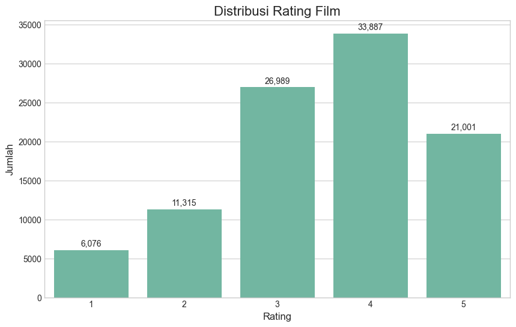
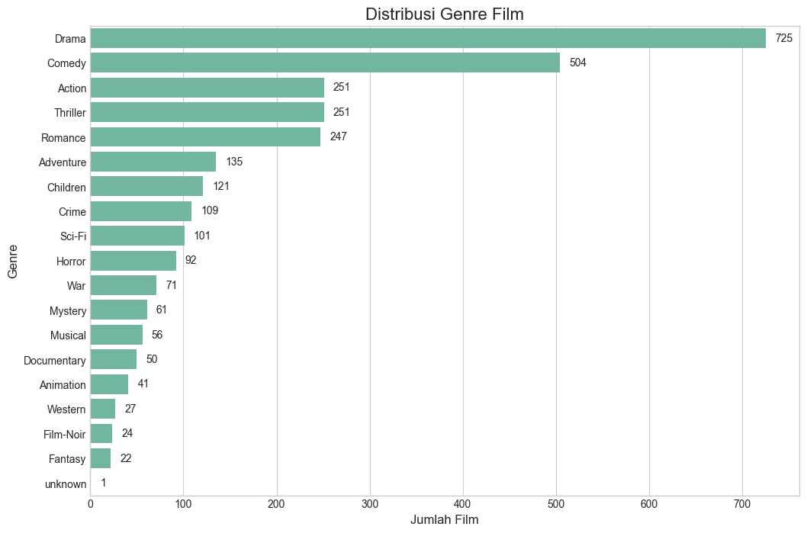
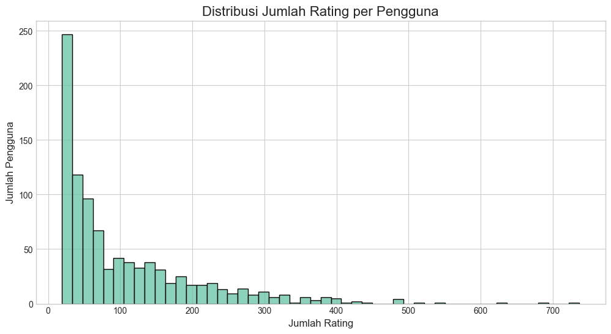
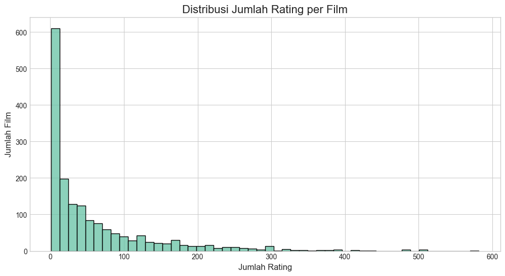
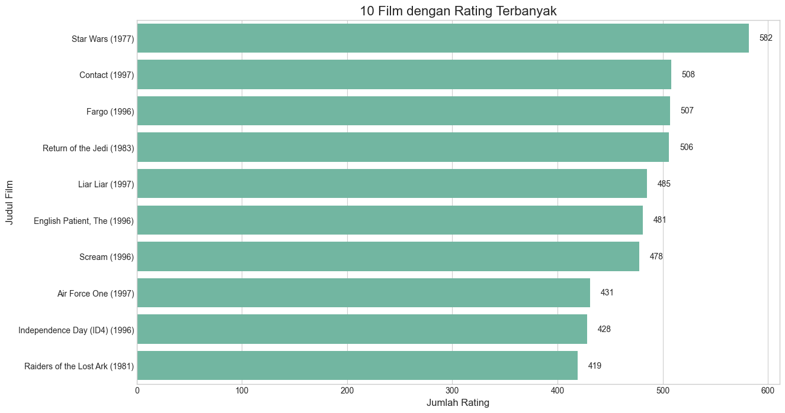

# Laporan Proyek Machine Learning - Sistem Rekomendasi Film

## Project Overview

Dalam lanskap digital kontemporer, proliferasi film di berbagai platform streaming telah menimbulkan paradoks di mana kelimpahan pilihan justru dapat menghambat pengambilan keputusan dan mengurangi kepuasan pengguna. Fenomena ini, yang disebut sebagai "paradoks pilihan," menunjukkan bahwa pilihan yang berlebihan dapat menyebabkan kelumpuhan dalam mengambil keputusan dan mengurangi kepuasan terhadap pilihan yang dibuat [1].

Untuk mengatasi tantangan ini, sistem rekomendasi telah dikembangkan sebagai alat yang efektif untuk membantu pengguna dalam menelusuri perpustakaan konten yang luas dengan memberikan saran yang dipersonalisasi [2]. Sistem-sistem ini memanfaatkan teknik pembelajaran mesin untuk menganalisis preferensi pengguna dan karakteristik item, memfasilitasi penyampaian rekomendasi yang relevan dan menarik [3]. Sebagai contoh, metode collaborative filtering memprediksi minat pengguna dengan mengidentifikasi pola dalam interaksi pengguna-item, sementara content-based filtering berfokus pada merekomendasikan item dengan atribut yang serupa dengan yang sebelumnya disukai oleh pengguna [4].

Proyek ini bertujuan mengembangkan sistem rekomendasi film menggunakan dataset MovieLens yang terkenal. Dengan mengimplementasikan pendekatan content-based filtering dan collaborative filtering, sistem ini diharapkan dapat membantu pengguna menemukan film yang sesuai dengan selera mereka, meningkatkan pengalaman menonton, dan mengatasi masalah paradoks pilihan.

### Referensi
[1]	B. Schwartz, *The paradox of choice: why more is less*, Reissued. New York, NY: Harper Perennial, 2007.

[2]	I. Saifudin dan T. Widiyaningtyas, “Systematic Literature Review on Recommender System: Approach, Problem, Evaluation Techniques, Datasets,” *IEEE Access*, vol. 12, hlm. 19827–19847, 2024, doi: 10.1109/ACCESS.2024.3359274.

[3]	F. Ricci, L. Rokach, dan B. Shapira, “Introduction to Recommender Systems Handbook,” dalam *Recommender Systems Handbook*, F. Ricci, L. Rokach, B. Shapira, dan P. B. Kantor, Ed., Boston, MA: Springer US, 2011, hlm. 1–35. doi: 10.1007/978-0-387-85820-3_1.

[4]	S. Jayalakshmi, N. Ganesh, R. Čep, dan J. Senthil Murugan, “Movie Recommender Systems: Concepts, Methods, Challenges, and Future Directions,” *Sensors*, vol. 22, no. 13, hlm. 4904, Jun 2022, doi: 10.3390/s22134904.

## Business Understanding

Industri konten digital dan streaming menghadapi tantangan dalam mempertahankan pengguna dan meningkatkan engagement. Salah satu kunci keberhasilan platform film adalah kemampuannya menyajikan konten yang relevan dengan preferensi pengguna.

### Problem Statements

- Bagaimana mengembangkan sistem rekomendasi yang dapat memberikan saran film yang relevan dan sesuai dengan preferensi pengguna?
- Bagaimana memanfaatkan data rating film yang ada untuk memahami pola preferensi pengguna?

### Goals

- Membangun sistem rekomendasi film yang dapat memberikan saran film berdasarkan preferensi pengguna dengan akurasi yang baik.
- Mengimplementasikan dan membandingkan dua pendekatan sistem rekomendasi: content-based filtering dan collaborative filtering.

### Solution Statements

- Mengembangkan model content-based filtering yang merekomendasikan film berdasarkan kemiripan karakteristik film (genre) dengan film yang disukai pengguna sebelumnya.
- Mengembangkan model collaborative filtering menggunakan PyTorch Lightning yang merekomendasikan film berdasarkan pola rating dari pengguna yang memiliki preferensi serupa.
- Mengevaluasi kedua model menggunakan metrik yang sesuai (RMSE dan R² untuk collaborative filtering dan precision untuk content-based filtering) untuk mengukur efektivitas rekomendasi yang dihasilkan.

## Data Understanding

Untuk proyek ini, saya menggunakan dataset MovieLens 100K yang berisi 100.000 rating dari 943 pengguna untuk 1.682 film. Dataset ini dapat diunduh dari [GroupLens Research](https://grouplens.org/datasets/movielens/100k/).

Dataset MovieLens 100K terdiri dari beberapa file, dengan file utama yang digunakan dalam proyek ini adalah:

1. `u.data`: File yang berisi rating film (943 pengguna × 1682 film)
2. `u.item`: File yang berisi informasi film
3. `u.user`: File yang berisi informasi pengguna
4. `u.genre`: File yang berisi informasi genre film

### Variabel pada Dataset

1. **File u.data (Rating Film)**:
   - `user_id`: ID unik untuk setiap pengguna (integer)
   - `item_id`: ID unik untuk setiap film (integer)
   - `rating`: Rating yang diberikan pengguna (integer 1-5)
   - `timestamp`: Waktu rating diberikan (unix time)

2. **File u.item (Informasi Film)**:
   - `movie_id`: ID unik untuk setiap film (integer)
   - `movie_title`: Judul film (string)
   - `release_date`: Tanggal rilis film (date)
   - `video_release_date`: Tanggal rilis video (date)
   - `IMDb_URL`: URL film di IMDb (string)
   - `unknown | Action | Adventure | Animation | Children's | Comedy | Crime | Documentary | Drama | Fantasy | Film-Noir | Horror | Musical | Mystery | Romance | Sci-Fi | Thriller | War | Western`: Genre film (binary)

3. **File u.user (Informasi Pengguna)**:
   - `user_id`: ID unik untuk setiap pengguna (integer)
   - `age`: Umur pengguna (integer)
   - `gender`: Jenis kelamin pengguna (string: 'M' untuk laki-laki, 'F' untuk perempuan)
   - `occupation`: Pekerjaan pengguna (string)
   - `zip_code`: Kode pos pengguna (string)

### Exploratory Data Analysis (EDA)

#### Statistik Deskriptif

Setelah menggabungkan data dari ketiga file utama, berikut adalah statistik deskriptif dari dataset gabungan:

| Statistik | user_id | movie_id | rating | timestamp | age |
|-----------|---------|----------|--------|-----------|-----|
| count     | 99268   | 99268    | 99268  | 99268     | 99268 |
| mean      | 463.69  | 428.26   | 3.53   | 8.83e+08  | 32.99 |
| std       | 265.85  | 330.39   | 1.13   | 5.34e+06  | 11.57 |
| min       | 2.00    | 2.00     | 1.00   | 8.75e+08  | 7.00 |
| 25%       | 256.00  | 176.00   | 3.00   | 8.79e+08  | 24.00 |
| 50%       | 449.00  | 323.00   | 4.00   | 8.83e+08  | 30.00 |
| 75%       | 682.00  | 634.00   | 4.00   | 8.88e+08  | 40.00 |
| max       | 943.00  | 1682.00  | 5.00   | 8.93e+08  | 73.00 |

#### Distribusi Rating

Berikut adalah distribusi rating yang diberikan pengguna:


*Placeholder untuk visualisasi distribusi rating*

Dari distribusi ini terlihat bahwa mayoritas rating yang diberikan adalah positif, dengan rating 4 bintang sebagai yang terbanyak. Hal ini menunjukkan adanya bias positif dalam dataset yang perlu dipertimbangkan dalam pengembangan model.

#### Distribusi Genre Film

Analisis terhadap distribusi genre film menunjukkan bahwa:


*Placeholder untuk visualisasi distribusi genre*

Genre Drama, Comedy, dan Action adalah genre yang paling dominan dalam dataset, sedangkan genre Film-Noir, Documentary, dan Fantasy memiliki jumlah film yang relatif sedikit. Distribusi yang tidak merata ini dapat mempengaruhi rekomendasi berbasis konten, terutama untuk genre yang kurang terwakili.

#### Distribusi Rating Per Pengguna dan Film

Terdapat variasi yang signifikan dalam jumlah rating yang diberikan oleh setiap pengguna:



Demikian juga dengan jumlah rating yang diterima oleh setiap film:



#### Film dengan Rating Terbanyak

Berikut adalah 10 film yang mendapatkan rating terbanyak:


*Placeholder untuk visualisasi film dengan rating terbanyak*

Film-film populer seperti "Star Wars (1977)" dan "Pulp Fiction (1994)" mendapatkan jumlah rating yang jauh lebih banyak dibandingkan film rata-rata, menunjukkan adanya popularity bias yang dapat mempengaruhi model collaborative filtering.

#### Film dengan Rating Tertinggi

Berikut adalah 10 film dengan rating rata-rata tertinggi (minimal 50 rating):


*Placeholder untuk visualisasi film dengan rating tertinggi*

Film-film klasik dan yang mendapat pengakuan kritikus cenderung memiliki rating rata-rata yang tinggi, menunjukkan korelasi antara kualitas film secara umum dengan preferensi penonton dalam dataset.

#### Key Insights dari EDA

Beberapa insight penting yang didapatkan dari EDA:
- Distribusi rating cenderung positif dengan mayoritas rating 4 (33,950) dan 3 (27,145) bintang, menunjukkan adanya bias positif yang perlu diantisipasi dalam pengembangan model rekomendasi.
- Genre Drama, Comedy, dan Action mendominasi dataset, yang mengindikasikan ketidakseimbangan genre yang perlu diperhatikan untuk content-based filtering.
- Terdapat variasi signifikan dalam jumlah rating per pengguna (1-737) dan per film (1-583), mencerminkan masalah sparsity yang umum dalam sistem rekomendasi.
- Film-film populer mendapatkan jauh lebih banyak rating, yang dapat menciptakan popularity bias dalam collaborative filtering.

## Data Preparation

Berikut adalah tahapan persiapan data yang dilakukan:

1. **Pemberian Nama Kolom**
   - Memberikan nama kolom yang sesuai untuk setiap file dataset berdasarkan dokumentasi untuk membantu analisis
   - Contoh: `ratings.columns = ['user_id', 'movie_id', 'rating', 'timestamp']`

2. **Penanganan Missing Value**
   - Mengubah `release_date` tanggal rilis ke datetime untuk meng-handle nilai yang hilang pada kolom
   - Mengisi nilai kosong pada kolom `video_release_date` dan `imdb_url` dengan string kosong
   - Menghapus film yang tidak memiliki`release_date` valid

3. **Ekstraksi Fitur Genre dan Penggabungan Data**
   - Mengubah kolom genre dari format one-hot encoding menjadi list genre untuk setiap film agar dataframe dapat digabung dengan baik
   - Menggabungkan informasi film, rating, dan pengguna menjadi satu dataframe untuk membantu analisis 
```py
# Menciptakan kolom genre sebagai list untuk setiap film
genre_columns = movies_cols[5:]
movies['genres'] = movies.apply(
    lambda row: [genre for genre, is_genre in zip(genre_columns, row[genre_columns]) if is_genre == 1],
    axis=1
)

# Menggabungkan data
data = ratings.merge(movies[['movie_id', 'title', 'genres']], on='movie_id')
data = data.merge(users[['user_id', 'gender', 'age', 'occupation']], on='user_id')
```

Berikut adalah informasi dataset setelah digabung:
```
# Menciptakan kolom genre sebagai list untuk setiap film
genre_columns = movies_cols[5:]
movies['genres'] = movies.apply(
    lambda row: [genre for genre, is_genre in zip(genre_columns, row[genre_columns]) if is_genre == 1],
    axis=1
)

# Menggabungkan data
data = ratings.merge(movies[['movie_id', 'title', 'genres']], on='movie_id')
data = data.merge(users[['user_id', 'gender', 'age', 'occupation']], on='user_id')
```

4. **Pembagian Data Training dan Testing**
   - Membagi dataset menjadi 80% training dan 20% testing dengan `train_test_split` untuk keperluan training dan evaluasi model
   - Membuat mapping untuk user_id dan movie_id ke indeks berurutan untuk keperluan model PyTorch
   - Menerapkan mapping tersebut ke dataset training dan testing

5. **Membuat Representasi Fitur Melalui TF-IDF untuk Content-Based Filtering**
   - Mengubah list genre menjadi string untuk memudahkan pemrosesan teks
   ```python
   movies['genres_str'] = movies['genres'].apply(lambda x: ' '.join(x))
   ```
   - Menerapkan TF-IDF Vectorizer untuk mengubah string genre menjadi representasi vektor numerik
   ```python
   tfidf = TfidfVectorizer(stop_words='english')
   tfidf_matrix = tfidf.fit_transform(movies['genres_str'])
   ```
   - Langkah ini memungkinkan perhitungan kemiripan antar film berdasarkan representasi vektor genre

Setelah persiapan data, dataset siap digunakan untuk membangun model rekomendasi.

## Modeling

Dalam proyek ini, saya mengimplementasikan dua pendekatan sistem rekomendasi:

1. **Content-based Filtering**: Merekomendasikan film berdasarkan kemiripan karakteristik film
2. **Collaborative Filtering**: Merekomendasikan film berdasarkan pola rating dari pengguna dengan preferensi serupa

### Content-based Filtering

Model Content-Based Recommender diimplementasikan dengan menggunakan TF-IDF (Term Frequency-Inverse Document Frequency) dan cosine similarity untuk mengukur kemiripan antar film berdasarkan genre.

**Cara kerja:**
1. **Pemanfaatan Representasi Fitur:** Menggunakan representasi vektor TF-IDF yang telah dibuat pada tahap persiapan data.
2. **Perhitungan Similarity Matrix:** Menghitung matriks kesamaan kosinus antara semua film.
   ```python
   cosine_sim = cosine_similarity(tfidf_matrix, tfidf_matrix)
   ```
3. **Rekomendasi Berdasarkan Kemiripan:** Dua pendekatan rekomendasi:
   - `recommend()`: Merekomendasikan film berdasarkan kemiripan dengan satu film referensi
   - `get_top_n_for_user()`: Merekomendasikan film berdasarkan profil pengguna dengan mempertimbangkan rating sebagai bobot preferensi


Model ini dapat efektif dalam memberikan rekomendasi yang memiliki karakteristik serupa dengan film yang disukai pengguna, namun terbatas pada fitur konten yang digunakan (dalam hal ini hanya genre).

#### Contoh Output Top-10 Model Content-based Filtering

Contoh penggunaan content-based recommender untuk film tertentu sebagai berikut:

```
Rekomendasi film yang mirip dengan 'Legends of the Fall (1994)':
1. Geronimo: An American Legend (1993) - Genre: Drama, Western - Skor Kemiripan: 0.7300
2. Gone with the Wind (1939) - Genre: Drama, Romance, War - Skor Kemiripan: 0.7270
3. English Patient, The (1996) - Genre: Drama, Romance, War - Skor Kemiripan: 0.7270
4. Casablanca (1942) - Genre: Drama, Romance, War - Skor Kemiripan: 0.7270
5. Rob Roy (1995) - Genre: Drama, Romance, War - Skor Kemiripan: 0.7270
6. Colonel Chabert, Le (1994) - Genre: Drama, Romance, War - Skor Kemiripan: 0.7270
7. Unforgiven (1992) - Genre: Western - Skor Kemiripan: 0.6866
8. Tombstone (1993) - Genre: Western - Skor Kemiripan: 0.6866
9. Wild Bill (1995) - Genre: Western - Skor Kemiripan: 0.6866
10. Wyatt Earp (1994) - Genre: Western - Skor Kemiripan: 0.6866
```

Selain itu, contoh penggunaan content-based recommender untuk pengguna dengan beberapa rating seperti ini:
```
user_ratings = {
    "Legends of the Fall (1994)": 5,
    "Star Wars (1977)": 5,
    "Pulp Fiction (1994)": 4,
    "Shawshank Redemption, The (1994)": 5,
    "Terminator, The (1984)": 3
}
```
adalah sebagai berikut:

```
Rekomendasi film berdasarkan rating pengguna:
1. Empire Strikes Back, The (1980) - Genre: Action, Adventure, Drama, Romance, Sci-Fi, War - Skor Rekomendasi: 2.0740
2. Crying Game, The (1992) - Genre: Action, Drama, Romance, War - Skor Rekomendasi: 1.8106
3. Return of the Jedi (1983) - Genre: Action, Adventure, Romance, Sci-Fi, War - Skor Rekomendasi: 1.7806
4. Gone with the Wind (1939) - Genre: Drama, Romance, War - Skor Rekomendasi: 1.7379
5. English Patient, The (1996) - Genre: Drama, Romance, War - Skor Rekomendasi: 1.7379
6. Casablanca (1942) - Genre: Drama, Romance, War - Skor Rekomendasi: 1.7379
7. Rob Roy (1995) - Genre: Drama, Romance, War - Skor Rekomendasi: 1.7379
8. Colonel Chabert, Le (1994) - Genre: Drama, Romance, War - Skor Rekomendasi: 1.7379
9. Sneakers (1992) - Genre: Crime, Drama, Sci-Fi - Skor Rekomendasi: 1.6946
10. Braveheart (1995) - Genre: Action, Drama, War - Skor Rekomendasi: 1.6646
```

### Collaborative Filtering 

Model Collaborative Filtering diimplementasikan menggunakan neural network PyTorch dengan bantuan framework PyTorch Lightning untuk mengoptimalkan proses training.

**Arsitektur Model:**
1. **Embedding Layers:** 
   - User embedding (dimensi 100) - mewakili preferensi pengguna
   - Movie embedding (dimensi 100) - mewakili karakteristik film
   - User bias dan movie bias - menangkap kecenderungan rating

2. **Neural Network:**
   - Interaksi antara user dan movie embeddings melalui perkalian elemen-wise
   - Lapisan fully connected dengan reduksi dimensi (100→50→25)
   - Lapisan dropout (0.2) untuk mencegah overfitting
   - Output layer untuk prediksi rating final

3. **Perhitungan Prediksi:**
   ```python
   user_emb = self.user_embedding(user_idx)
   movie_emb = self.movie_embedding(movie_idx)
   user_b = self.user_bias(user_idx).squeeze()
   movie_b = self.movie_bias(movie_idx).squeeze()
   
   interaction = user_emb * movie_emb
   
   x = self.fc_layers(interaction)
   x = self.final_layer(x).squeeze()
   pred = x + user_b + movie_b + self.global_bias
   ```

Model ini mempelajari representasi laten dari pengguna dan film dalam ruang embedding yang sama, kemudian menggunakan representasi tersebut untuk memprediksi rating. Model ini dapat menangkap hubungan yang lebih kompleks, namun cenderung bergantung pada jumlah data dan kondisi sparsity pada data.

#### Training Collaborative Filtering

Proses pelatihan model collaborative filtering dikonfigurasi sebagai berikut:

**Konfigurasi Training:**
- **Optimizer:** Adam dengan learning rate 5e-4
- **Loss Function:** Mean Squared Error (MSE)
- **Batch Size:** 512
- **Maximum Epochs:** 50

**Teknik Regularisasi:**
- L2 regularization (1e-5)
- Dropout (0.2)
- Gradient clipping (1.0)

**Callbacks:**
- **Early Stopping:** Dengan patience 7 epoch dan delta 0.001
- **Model Checkpoint:** Menyimpan 2 model terbaik berdasarkan validation loss
- **Learning Rate Scheduler:** Mengurangi learning rate dengan faktor 0.5 jika validation loss tidak membaik selama 3 epoch

```python
trainer = pl.Trainer(
    max_epochs=50,
    callbacks=[checkpoint_callback, early_stop_callback],
    logger=logger,
    accelerator='gpu',
    devices=1, 
    log_every_n_steps=10,
    num_sanity_val_steps=0,
    gradient_clip_val=1.0,
    deterministic=True 
)
```

Training dilakukan dengan memanfaatkan akselerasi GPU untuk mempercepat proses pembelajaran dan menghasilkan model yang dapat memprediksi rating dengan akurasi yang baik.

#### Contoh Output Top-10 Collaborative Filtering
Berikut adalah contoh rekomendasi film menggunakan model collaborative filtering untuk pengguna dengan user_id 196:

```
Rekomendasi film untuk pengguna 196:
1. Hugo Pool (1997) - Genre: Romance - Prediksi Rating: 4.42
2. Swept from the Sea (1997) - Genre: Romance - Prediksi Rating: 4.40
3. To Live (Huozhe) (1994) - Genre: Drama - Prediksi Rating: 4.27
4. Washington Square (1997) - Genre: Drama - Prediksi Rating: 4.23
5. Year of the Horse (1997) - Genre: Documentary - Prediksi Rating: 4.20
6. Gattaca (1997) - Genre: Drama, Sci-Fi, Thriller - Prediksi Rating: 4.18
7. Assignment, The (1997) - Genre: Thriller - Prediksi Rating: 4.16
8. Wrong Trousers, The (1993) - Genre: Animation, Comedy - Prediksi Rating: 4.14
9. Some Folks Call It a Sling Blade (1993) - Genre: Drama, Thriller - Prediksi Rating: 4.14
10. Much Ado About Nothing (1993) - Genre: Comedy, Romance - Prediksi Rating: 4.12
```

## Evaluation

Untuk mengevaluasi kualitas rekomendasi yang dihasilkan oleh model, saya menggunakan dua metrik utama:

### 1. Root Mean Squared Error (RMSE) dan R² untuk Collaborative Filtering

**RMSE** mengukur selisih antara rating yang diprediksi oleh model dengan rating sebenarnya yang diberikan oleh pengguna. Semakin rendah nilai RMSE, semakin baik model dalam memprediksi rating.

Formula RMSE:
```
RMSE = sqrt(1/n * Σ(y_true - y_pred)²)
```
di mana:
- y_true adalah rating sebenarnya
- y_pred adalah rating yang diprediksi
- n adalah jumlah prediksi

**R²** (Koefisien Determinasi) mengukur seberapa baik model menjelaskan variasi dalam data. Nilai R² berkisar antara 0 hingga 1, di mana nilai yang lebih tinggi menunjukkan model yang lebih baik.

Formula R²:
```
R² = 1 - (Σ(y_true - y_pred)² / Σ(y_true - y_mean)²)
```
di mana:
- y_mean adalah rata-rata nilai y_true

### 2. Precision@K untuk Content-Based Filtering

Precision@K mengukur proporsi item yang relevan di antara K item teratas yang direkomendasikan. Dalam konteks ini, item dianggap relevan jika memiliki genre yang sama dengan film acuan.

Formula Precision@K:
```
Precision@K = (jumlah item relevan dalam K rekomendasi) / K
```

### Hasil Evaluasi

#### Collaborative Filtering Model

Berikut adalah hasil evaluasi model collaborative filtering pada dataset uji:

```
RMSE: 0.9307
R² Score: 0.3165
```

Nilai RMSE 0.9307 menunjukkan bahwa rata-rata prediksi model menyimpang sekitar 0.93 bintang dari rating sebenarnya pada skala 1-5. Nilai ini cukup baik mengingat skala rating hanya 1-5.

Namun, nilai R² yang hanya 0.3165 mengindikasikan bahwa model hanya mampu menjelaskan sekitar 31.6% variasi dalam rating pengguna. Ini menunjukkan keterbatasan model collaborative filtering dalam memprediksi preferensi pengguna dengan akurat, kemungkinan karena sparsitas data rating dan kompleksitas preferensi pengguna.

Grafik performa training model collaborative filtering menunjukkan penurunan loss yang stabil:


Dari grafik di atas, terlihat bahwa model mengalami konvergensi yang baik dengan penurunan loss yang stabil. Gap yang kecil antara training loss dan validation loss menunjukkan model tidak mengalami overfitting.

#### Content-Based Filtering Model

Evaluasi model content-based filtering dilakukan dengan menghitung precision@10 pada rekomendasi yang dihasilkan. Kita menghitung seberapa banyak film yang direkomendasikan memiliki setidaknya satu genre yang sama dengan film acuan.

Untuk beberapa film populer, hasilnya adalah sebagai berikut:

```
Toy Story (1995) - Precision@10: 1.00
Star Wars (1977) - Precision@10: 1.00
Pulp Fiction (1994) - Precision@10: 1.00
Shawshank Redemption, The (1994) - Precision@10: 1.00
Jurassic Park (1993) - Precision@10: 1.00

Rata-rata Precision@10: 1.0000
```

Hasil ini menunjukkan bahwa model content-based filtering berhasil memberikan rekomendasi yang sangat relevan dengan selalu menyertakan film-film yang memiliki genre yang sama dengan film referensi.

### Analisis Perbandingan Model

1. **Collaborative Filtering**:
   - **Kelebihan**: Dapat memberikan rekomendasi film yang tidak terkait secara konten tapi populer di antara pengguna dengan selera serupa.
   - **Kekurangan**: 
     - Mengalami cold-start problem untuk pengguna baru atau film baru.
     - Memiliki nilai R² yang rendah (0.3165), menunjukkan keterbatasan dalam menjelaskan variasi preferensi pengguna.
     - Membutuhkan data rating yang cukup banyak untuk memberikan rekomendasi yang akurat.

2. **Content-Based Filtering**:
   - **Kelebihan**: 
     - Memberikan rekomendasi yang konsisten berdasarkan konten film dan tidak memerlukan data dari pengguna lain.
     - Mencapai Precision@10 sempurna (1.0) untuk film-film yang dievaluasi.
   - **Kekurangan**: Terbatas pada fitur konten yang digunakan (dalam kasus ini, hanya genre film), sehingga mungkin kehilangan nuansa lain yang mempengaruhi preferensi pengguna.

## Conclusion

Berdasarkan hasil pengembangan dan evaluasi sistem rekomendasi film, dapat disimpulkan bahwa:
- Model content-based filtering dapat menjadi pendekatan terbaik karena berhasil memberikan rekomendasi film yang relevan dengan akurasi sempurna (precision@10 = 1.0).
- Content-based filtering sangat bergantung pada metadata film (genre), namun sangat akurat dalam memberikan rekomendasi yang konsisten.
- Collaborative filtering dapat menemukan pola yang tidak terlihat dalam konten, namun memiliki keterbatasan dalam menjelaskan variasi preferensi pengguna (R² rendah) dan memerlukan data yang cukup besar.
- Sistem ini dapat ditingkatkan dengan menambahkan lebih banyak fitur konten (seperti aktor, sutradara, kata kunci), menggunakan pendekatan hybrid yang menggabungkan kedua metode, atau mengimplementasikan model deep learning yang lebih kompleks untuk meningkatkan nilai R².

Secara keseluruhan, sistem rekomendasi film yang dikembangkan dalam proyek ini telah berhasil memberikan solusi untuk masalah yang diidentifikasi dalam problem statement. 